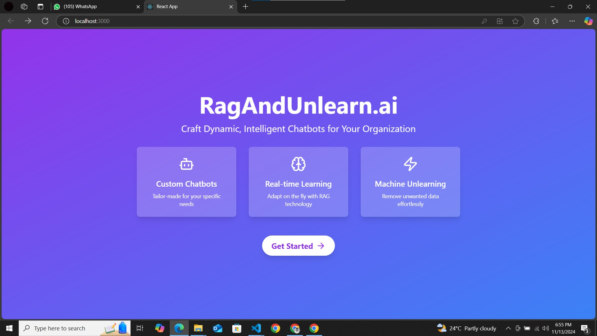

# RagandUnlearn.ai -A MLaaS Platform for creating Customizable and Responsible AI Assistants

## Youtube Demo: https://youtu.be/gazpr_Fm2HE

RagAndUnlearn.ai made it to the top 15 among 6375 teams at Rakathon 2024 conducted by Rakuten and HackerEarth!

- I and my teammate Jahnavi wanted to experiment Machine Unlearning technique in Gen AI along with incorporating RAG (Retrieval Augmented Generation) to make Generative AI dynamic (learn and unlearn at real-time).
-  So, we came up with a platform that automates the process of creating AI assistants tailored to the specific needs of businesses using Retrieval Augmented Generation for real-time data integration and Machine Unlearning for guideline-compliant responses.
- Users can select a base LLM, upload their data, and automatically convert it to vector embeddings for customized AI solutions.
- Platform allows real-time updates and continuous learning, with the flexibility to prevent responses that go against business policies.
- Thus, our platform provides a 'no-code service' to the users to customize their AI assistants as per their needs. (I myself used this project to create another amazing project xD, RAG creates wonders and we're offering that as a zero-code service :)
